<div align="center">
  
# 📦 StockWise

<p align="center">

</p>

[](https://kotlinlang.org)
[](https://developer.android.com)
[](https://developer.android.com/jetpack/compose)
<br>


### Modern Android Inventory Management App

**An inventory management application built with Clean Architecture, MVI pattern, and modern Android development practices.**

</div>

---

## 📱 Features

### Core Functionality
- **📊 Dashboard** - Real-time inventory overview with key metrics, low stock indicator, and recent activity
- **📦 Product Management** - Full CRUD operations with search, filtering, and sorting capabilities
- **📁 Categories** - Organize products with color-coded categories and delete protection
- **🚚 Suppliers** - Manage supplier information with contact details
- **📈 Stock Tracking** - Record stock movements (in/out/adjustments) with complete history

### User Experience
- **🔍 Advanced Search** - Search products by name or SKU with real-time results
- **🎛️ Smart Filtering** - Filter by category, stock status (in stock, low stock, out of stock)
- **📊 Sorting Options** - Sort by name, price, stock level, or last updated

---

## 📸 Screenshots

<div align="center">

| Dashboard | Dashboard | Product | Product Filter/Sort | Product Detail |
|:---------:|:---------:|:---------:|:---------:|:---------:|
| 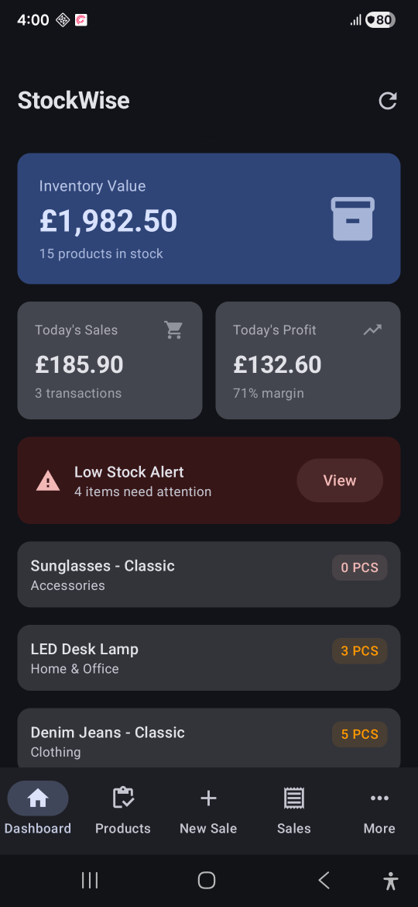 | 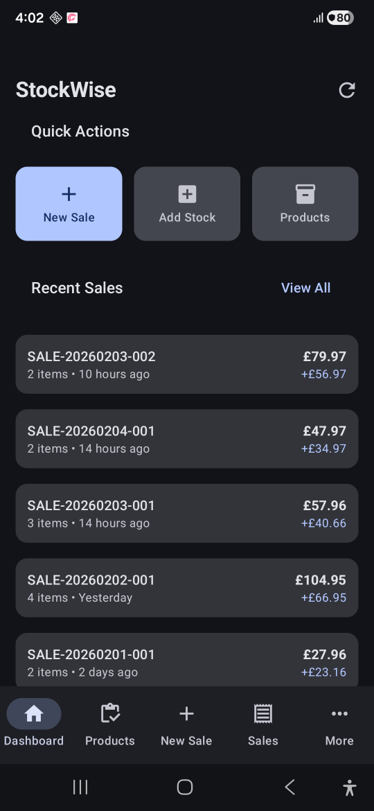 | 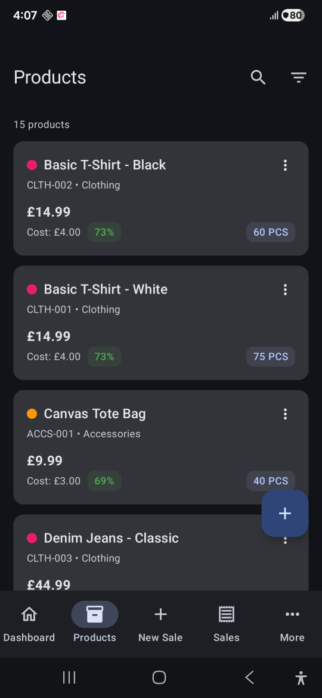 | 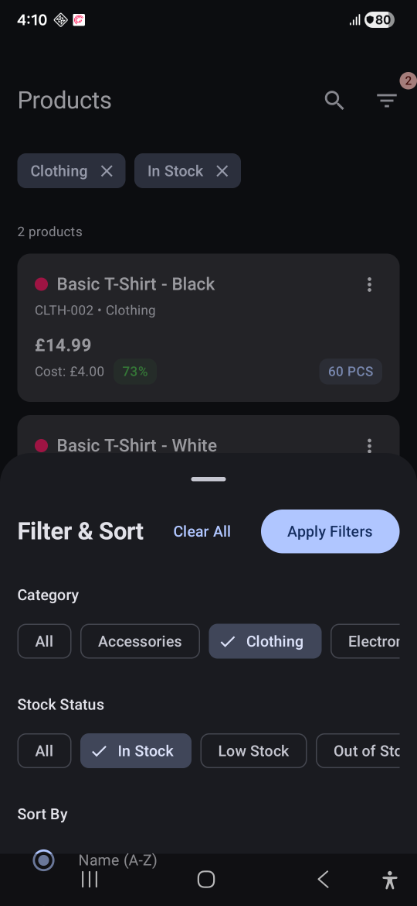 | 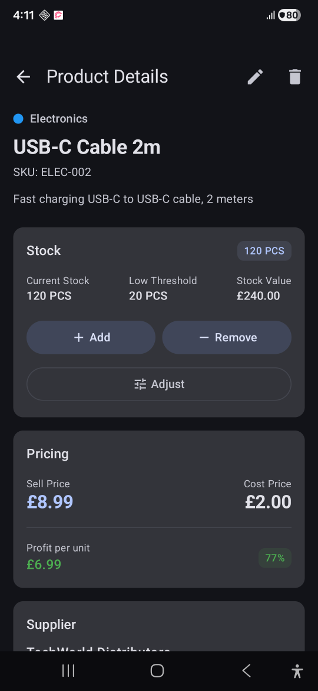 |

| Suppliers | Categories | Stock Movement | Stock Movement | Stock Movement |
|:-----------:|:-----------:|:-----------:|:-----------:|:-----------:|
| 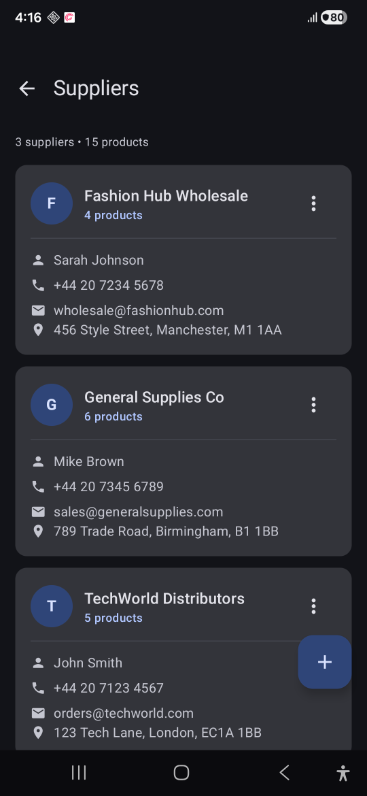 | 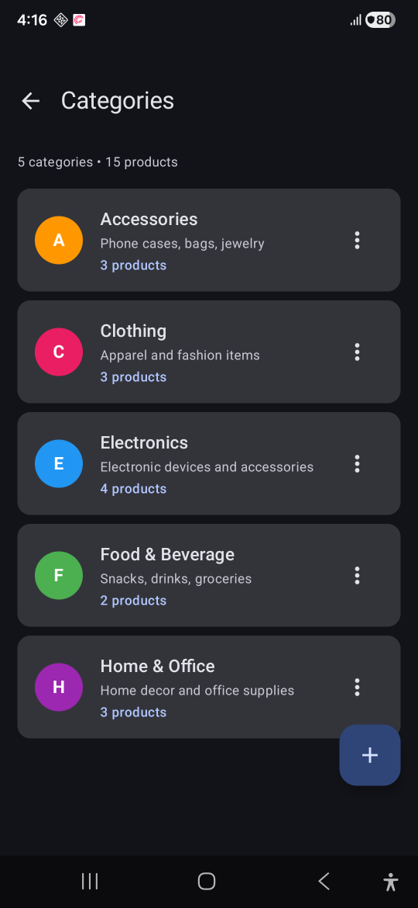 | 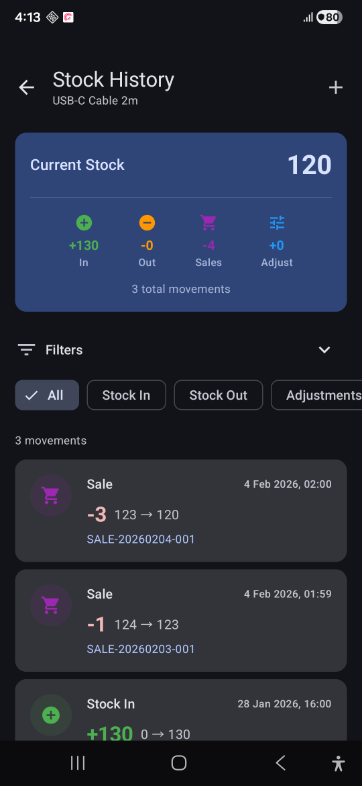 | 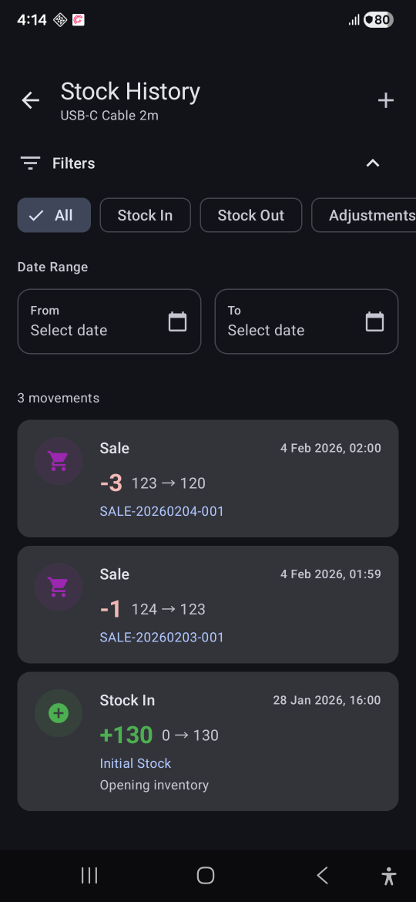 | 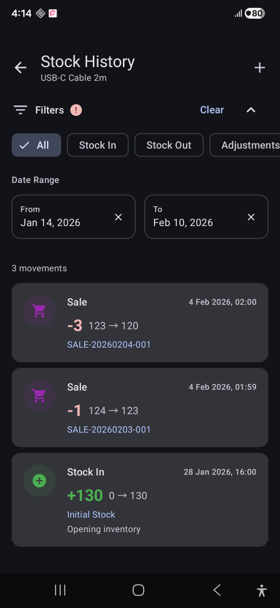 |

</div>

---
## 🎬 [StockWise DEMO - YouTube](https://youtu.be/hc8KFlWHrpQ)

| Dashboard | Products | Stock Movements |
|:-----------:|:-----------:|:-----------:|
|  |  |  |

---

## 🛠️ Tech Stack

| Category | Technologies |
|----------|-------------|
| **Language** | Kotlin 2.2.21 |
| **UI Framework** | Jetpack Compose with Material 3 |
| **Architecture** | Clean Architecture + MVI |
| **Dependency Injection** | Hilt |
| **Database** | Room (SQLite) |
| **Async** | Kotlin Coroutines & Flow |
| **Navigation** | Jetpack Navigation Compose |
| **Testing** | JUnit, MockK, Turbine, Truth |

---

## 📲 [Download & Install the App](https://github.com/UsmanAnsari/StockWise/releases/download/1.0.0/app-debug.apk)

---
## 🏗️ Architecture

StockWise is built with **Clean Architecture** and **MVI (Model-View-Intent)** pattern, ensuring maintainability, testability, and scalability.

### Clean Architecture Layers
```
┌─────────────────────────────────────────────────────────────┐
│                    PRESENTATION LAYER                       │
│  ┌─────────────┐  ┌─────────────┐  ┌─────────────────────┐  │
│  │   Screens   │  │  ViewModels │  │  Contracts (MVI)    │  │
│  │  (Compose)  │  │   (State)   │  │ State/Event/Effect  │  │
│  └─────────────┘  └─────────────┘  └─────────────────────┘  │
├─────────────────────────────────────────────────────────────┤
│                      DOMAIN LAYER                           │
│  ┌─────────────┐  ┌─────────────┐  ┌─────────────────────┐  │
│  │  Use Cases  │  │   Models    │  │Repository Interfaces│  │
│  │             │  │  (Domain)   │  │                     │  │
│  └─────────────┘  └─────────────┘  └─────────────────────┘  │
├─────────────────────────────────────────────────────────────┤
│                       DATA LAYER                            │
│  ┌─────────────┐  ┌─────────────┐  ┌─────────────────────┐  │
│  │Repositories │  │    DAOs     │  │      Entities       │  │
│  │   (Impl)    │  │   (Room)    │  │                     │  │
│  └─────────────┘  └─────────────┘  └─────────────────────┘  │
└─────────────────────────────────────────────────────────────┘
```

### MVI Pattern

The app follows **unidirectional data flow** for predictable state management:
```
┌────────────────────────────────────────────────────────────────────────────┐
│                              MVI FLOW                                       │
├────────────────────────────────────────────────────────────────────────────┤
│                                                                             │
│                           ┌──────────────┐                                  │
│       ┌──────────────────▶│     VIEW     │──────────────────┐              │
│       │                   │   (Screen)   │                  │              │
│       │                   └──────────────┘                  │              │
│       │                                                     │              │
│       │                                                     │              │
│    STATE                                                  EVENT            │
│  (Immutable)                                            (Intent)           │
│       │                                                     │              │
│       │                   ┌──────────────┐                  │              │
│       │                   │              │                  │              │
│       └───────────────────│  VIEWMODEL   │◀─────────────────┘              │
│                           │              │                                  │
│                           └──────┬───────┘                                  │
│                                  │                                          │
│                           ┌──────▼───────┐                                  │
│                           │   USE CASE   │                                  │
│                           │   (Domain)   │                                  │
│                           └──────────────┘                                  │
│                                                                             │
└────────────────────────────────────────────────────────────────────────────┘
```

### Why MVI?

| Benefit | Description |
|---------|-------------|
| 🔄 **Predictable** | Unidirectional flow makes state changes traceable |
| 🧪 **Testable** | State transitions are easily unit tested |
| 🐛 **Debuggable** | Single state object simplifies debugging |
| 📱 **Lifecycle Safe** | State survives configuration changes |

---

## 🗄️ Database Schema

StockWise uses **Room** database with **6 entities** including a **junction table** for many-to-many relationships.

### Entity Relationship Diagram
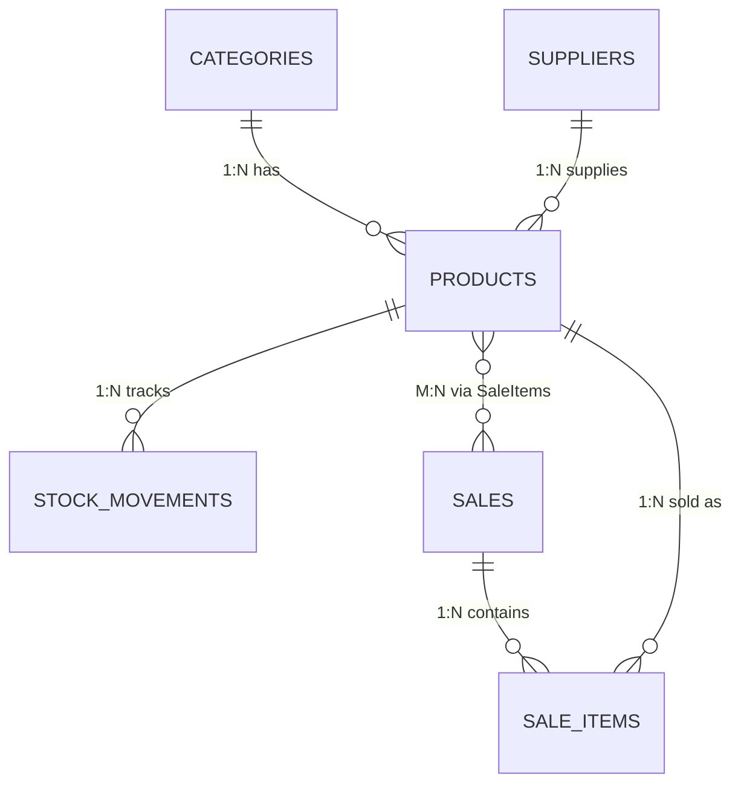

### Relationships

| Relationship | Type | Description |
|--------------|------|-------------|
| Category → Products | **1:N** | One category contains many products |
| Supplier → Products | **1:N** | One supplier supplies many products |
| Product → Stock Movements | **1:N** | One product has many stock changes |
| **Product ↔ Sales** | **M:N** | Many-to-many via `SaleItems` junction table |

### Junction Table: Sale Items

The `SALE_ITEMS` table serves as a **junction table** enabling the many-to-many relationship between Products and Sales:
```
┌──────────┐       ┌─────────────┐       ┌──────────┐
│ PRODUCTS │◄──────│ SALE_ITEMS  │──────►│  SALES   │
│          │  1:N  │ (Junction)  │  N:1  │          │
│    id    │       │ productId   │       │    id    │
│          │       │ sale_id     │       │          │
└──────────┘       │ quantity    │       └──────────┘
                   │ unitPrice*  │
                   └─────────────┘
                   
* Snapshot fields preserve data at time of sale
```

### Design Highlights

| Feature | Implementation |
|---------|---------------|
| **M:N Relationship** | `SaleItems` junction table links Products ↔ Sales |
| **Data Snapshots** | Product name, SKU, price stored in SaleItems for historical accuracy |
| **Soft Delete** | Products use `isActive` flag to preserve referential integrity |
| **Audit Trail** | `StockMovements` tracks every inventory change |
| **Delete Protection** | Categories/Suppliers can't be deleted with associated products |

---


## 🚀 Getting Started

### Installation

1. **Clone the repository**

2. **Open in Android Studio**

3. **Build and Run**

### Running Tests
```bash
# Unit tests
./gradlew test

# Instrumented tests (requires emulator/device)
./gradlew connectedAndroidTest
```

---

## 📁 Project Structure
```
app/src/main/java/com/yourpackage/stockwise/
│
├── 📂 data/                      # Data Layer
│   ├── local/
│   │   ├── dao/                  # Room DAOs
│   │   ├── entity/               # Room Entities & Relations
│   │   └── StockWiseDatabase.kt  # Room Database & Converters
│   └── repository/               # Repository Implementations
│
├── 📂 domain/                    # Domain Layer
│   ├── model/                    # Domain Models
│   ├── repository/               # Repository Interfaces
│   └── usecase/                  # Use Cases
│       ├── dashboard/            
│       ├── product/              
│       ├── category/             
│       ├── supplier/             
│       └── stock/                
│
├── 📂 ui/                        # ui Layer
│   ├── base/                     # Base MVI classes
│   ├── components/               # Shared UI components
│   ├── navigation/               # Navigation setup
│   ├── dashboard/                # Dashboard screen
│   ├── products/                 # Products screens
│   ├── categories/               # Categories screen
│   ├── suppliers/                # Suppliers screen
│   └── stock/                    # Stock movement screen
│
├── 📂 di/                        # Dependency Injection
│   ├── DatabaseModule.kt
│   └── RepositoryModule.kt
│
└── 📂 util/                      # Utilities
```

---

## 🧪 Testing

StockWise includes comprehensive test coverage:

### Test Statistics
- **~95 tests** across unit and instrumented tests
- **60-75% coverage** of critical business logic

### Test Categories

| Type | Location | Coverage |
|------|----------|----------|
| **Use Case Tests** | `test/.../domain/usecase/` | Business logic validation |
| **ViewModel Tests** | `test/.../ui/` | State transitions & effects |
| **DAO Tests** | `androidTest/.../data/local/dao/` | Database queries |

### Testing Approach
```kotlin
// Example: ViewModel test with Turbine
@Test
fun `search query filters products correctly`() = runTest {
    // Arrange
    viewModel = createViewModel()
    advanceUntilIdle()
    
    // Act
    viewModel.onEvent(Event.OnSearchQueryChanged("iPhone"))
    advanceUntilIdle()
    
    // Assert
    val state = viewModel.uiState.value
    assertThat(state.filteredProducts.all { 
        it.product.name.contains("iPhone", ignoreCase = true)
    }).isTrue()
}
```

---

## 📊 Use Cases Overview

StockWise implements **32 Use Cases** following the Single Responsibility Principle **(SOLID Principle)**:

<details>
<summary><b>Dashboard Use Cases (4)</b></summary>

- `GetInventoryStatsUseCase` - Fetch total products, stock value, categories count
- `GetDailySalesSummaryUseCase` - Daily sales metrics
- `GetLowStockProductsUseCase` - Products below threshold
- `GetRecentSalesUseCase` - Recent sales activity

</details>

<details>
<summary><b>Product Use Cases (8)</b></summary>

- `GetProductsWithDetailsUseCase` - List products with category/supplier
- `GetProductWithDetailsUseCase` - Single product details
- `GetProductByIdUseCase` - Fetch product by ID
- `FilterProductsUseCase` - Filter and sort products
- `ValidateProductUseCase` - Form validation
- `CreateProductUseCase` - Create new product
- `UpdateProductUseCase` - Update existing product
- `DeleteProductUseCase` - Soft delete product

</details>

<details>
<summary><b>Category Use Cases (7)</b></summary>

- `GetCategoriesUseCase` - List all categories
- `GetCategoriesWithProductCountUseCase` - Categories with product counts
- `GetCategoryByIdUseCase` - Single category
- `ValidateCategoryUseCase` - Form validation
- `CreateCategoryUseCase` - Create category
- `UpdateCategoryUseCase` - Update category
- `DeleteCategoryUseCase` - Delete (with protection)

</details>

<details>
<summary><b>Supplier Use Cases (7)</b></summary>

- `GetSuppliersUseCase` - List all suppliers
- `GetSuppliersWithProductCountUseCase` - Suppliers with product counts
- `GetSupplierByIdUseCase` - Single supplier
- `ValidateSupplierUseCase` - Form validation
- `CreateSupplierUseCase` - Create supplier
- `UpdateSupplierUseCase` - Update supplier
- `DeleteSupplierUseCase` - Delete (with protection)

</details>

<details>
<summary><b>Stock Use Cases (6)</b></summary>

- `GetStockMovementsForProductUseCase` - Movement history
- `GetStockMovementsSummaryUseCase` - Calculate totals
- `FilterStockMovementsUseCase` - Filter by type/date
- `AddStockUseCase` - Add stock
- `RemoveStockUseCase` - Remove stock
- `AdjustStockUseCase` - Set stock level

</details>

---

## 🎯 Key Implementation Highlights

### 1. MVI Contract Pattern
```kotlin
ProductsContract.kt
 
    data class ProductsState(
        val isLoading: Boolean = true,
        val products: List<ProductWithDetails> = emptyList(),
        val searchQuery: String = ""
        // ... more state
    ) : UiState {
        // Computed properties
        val isEmpty: Boolean get() = products.isEmpty() && !isLoading
    }
    
    sealed interface ProductsEvent : UiEvent {
        data object LoadProducts : ProductsEvent
        data class OnSearchQueryChanged(val query: String) : ProductsEvent
        // ... more events
    }
    
    sealed interface ProductsEffect : UiEffect {
        data class NavigateToDetail(val productId: Long) : ProductsEffect
        data class ShowSnackbar(val message: String) : ProductsEffect
    }
}
```

### 2. Use Case with Validation
```kotlin
class ValidateProductUseCase @Inject constructor(
    private val productRepository: ProductRepository
) {
    suspend operator fun invoke(params: ValidationParams): ValidationResult {
        val errors = mutableMapOf<String, String>()
        
        // Name validation
        if (params.name.isBlank()) {
            errors[FIELD_NAME] = "Product name is required"
        }
        
        // SKU uniqueness check
        val existingProduct = productRepository.getProductBySku(params.sku)
        if (existingProduct != null && existingProduct.id != params.excludeProductId) {
            errors[FIELD_SKU] = "SKU already exists"
        }
        
        return ValidationResult(errors.isEmpty(), errors)
    }
}
```

### 3. Delete Protection
```kotlin
class DeleteCategoryUseCase @Inject constructor(
    private val categoryRepository: CategoryRepository,
    private val productRepository: ProductRepository
) : SuspendUseCase<Long, Result<Unit>> {
    
    override suspend fun invoke(params: Long): Result<Unit> {
        val productCount = productRepository.getProductCountByCategory(params)
        
        if (productCount > 0) {
            return Result.failure(
                CategoryHasProductsException(
                    "Cannot delete category with $productCount products"
                )
            )
        }
        
        return categoryRepository.deleteCategory(params)
    }
}
```

---

## 🗺️ Roadmap

- [x] Phase 1: Database & Foundation
- [x] Phase 2: Clean Architecture + MVI Refactor
- [x] Phase 3: Testing
- [ ] Phase 4: Sales Module (POS)
- [ ] Phase 5: Reports & Analytics
- [ ] Phase 6: Barcode Scanning

---

## 👤 Author

**Usman Ali Ansari**

- GitHub: [@UsmanAnsari](https://github.com/UsmanAnsari)
- LinkedIn: [usman1ansari](https://www.linkedin.com/in/usman1ansari)
- Email: usman10ansari@gmail.com

---

<div align="center">

⭐ **Star this repo if you find it helpful!** ⭐

</div>
