<div align="center">
  
# 📦 StockWise

<p align="center">

</p>

[](https://kotlinlang.org)
[](https://developer.android.com)
[](https://developer.android.com/jetpack/compose)
[](https://github.com/UsmanAnsari/StockWise)


### Modern Android Inventory Management App

**A production-grade inventory management application demonstrating Clean Architecture, MVI pattern, complex relational database design (including M:N relationships), and comprehensive test coverage.**

*Built as a portfolio project to showcase local-first architecture and domain complexity for mid-level to senior Android engineering roles.*
</div>

---

## 📱 Features

### Core Functionality
- **📊 Dashboard** - Real-time inventory overview with key metrics, low stock indicator, and recent activity
- **📦 Product Management** - Full CRUD operations with search, filtering, and sorting capabilities
- **📁 Categories** - Organize products with color-coded categories and delete protection
- **🚚 Suppliers** - Manage supplier information with contact details
- **📈 Stock Tracking** - Record stock movements (in/out/adjustments) with complete history

### Technical Highlights
- **🏗️ Clean Architecture** — Strict layer separation with dependency inversion across all 5 feature modules
- **🔄 MVI Pattern** — Unidirectional data flow with immutable state across all screens
- **🗄️ Complex Database Schema** — 6 Room entities including a M:N junction table with snapshot data
- **🔒 Referential Integrity** — Soft delete and delete-protection patterns to preserve data consistency
- **📋 32 Use Cases** — Every operation isolated to a single-responsibility use case
- **🧪 95+ Tests** — Unit tests for use cases and ViewModels, instrumented DAO tests

### User Experience
- **🔍 Advanced Search** - Search products by name or SKU with real-time results
- **🎛️ Smart Filtering** - Filter by category, stock status (in stock, low stock, out of stock)
- **📊 Sorting Options** - Sort by name, price, stock level, or last updated

---

## 📸 Screenshots

<div align="center">

| Dashboard | Dashboard | Product | Product Filter/Sort | Product Detail |
|:---------:|:---------:|:---------:|:---------:|:---------:|
| 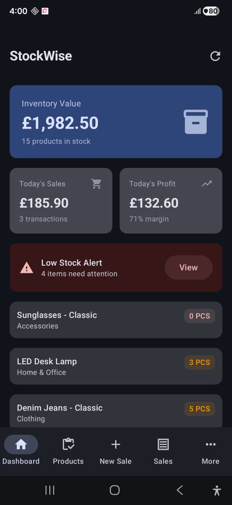 | 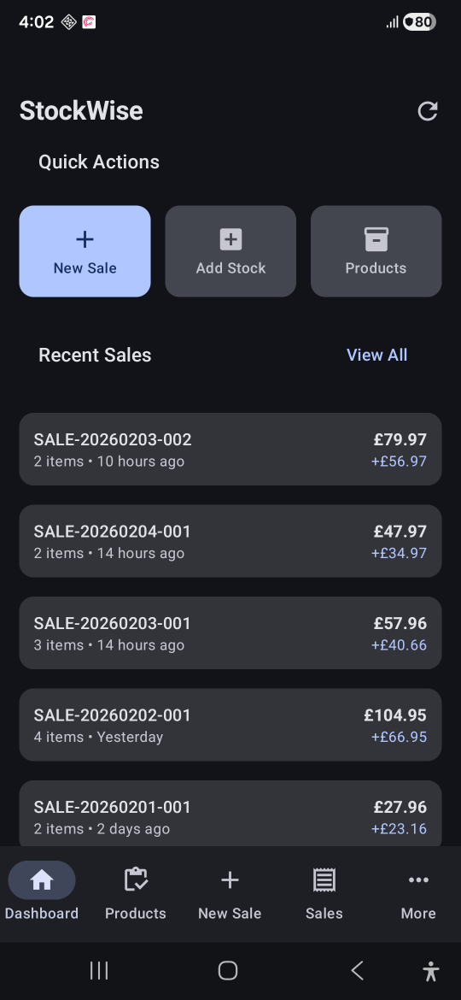 | 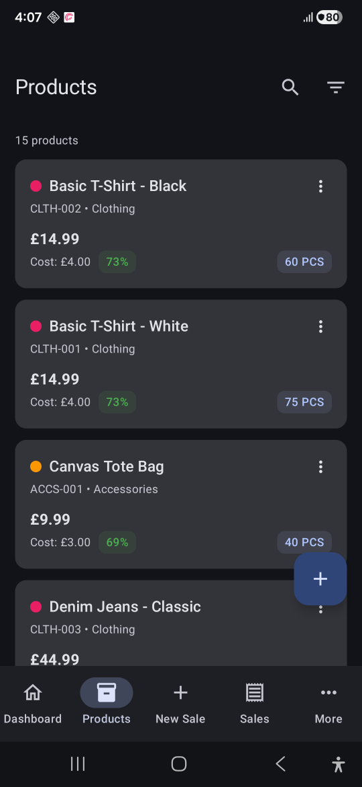 | 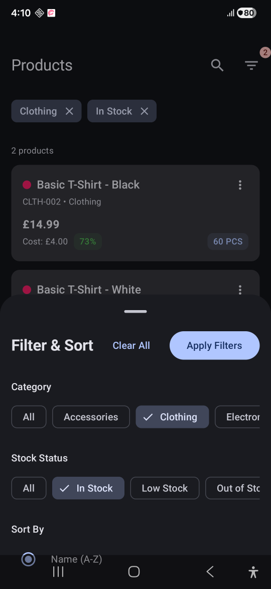 | 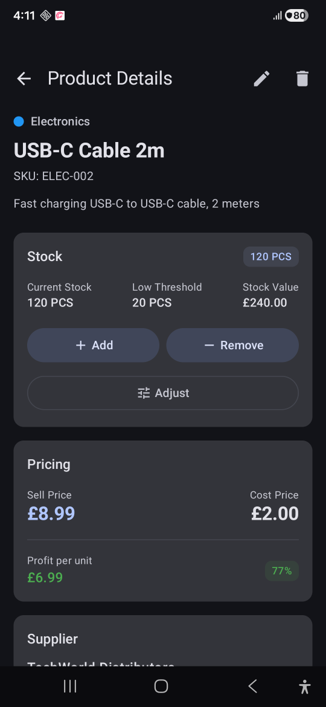 |

| Suppliers | Categories | Stock Movement | Stock Movement | Stock Movement |
|:-----------:|:-----------:|:-----------:|:-----------:|:-----------:|
| 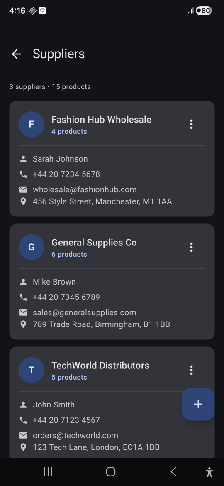 | 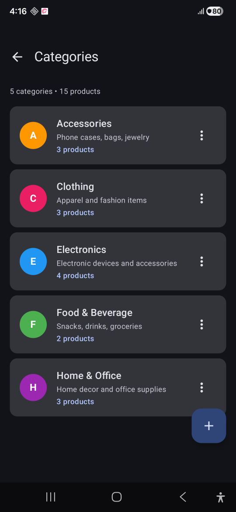 | 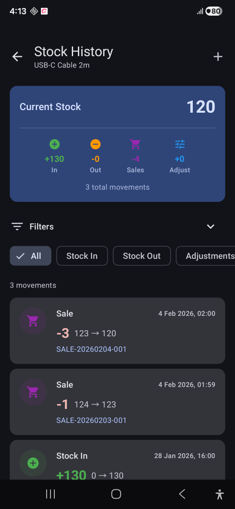 | 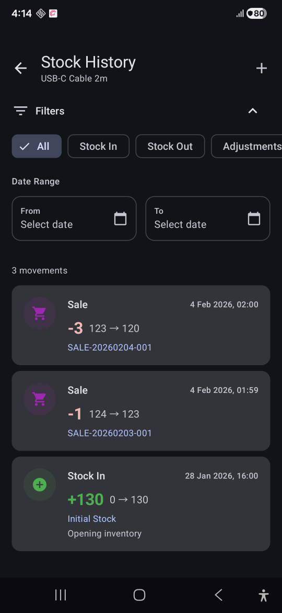 | 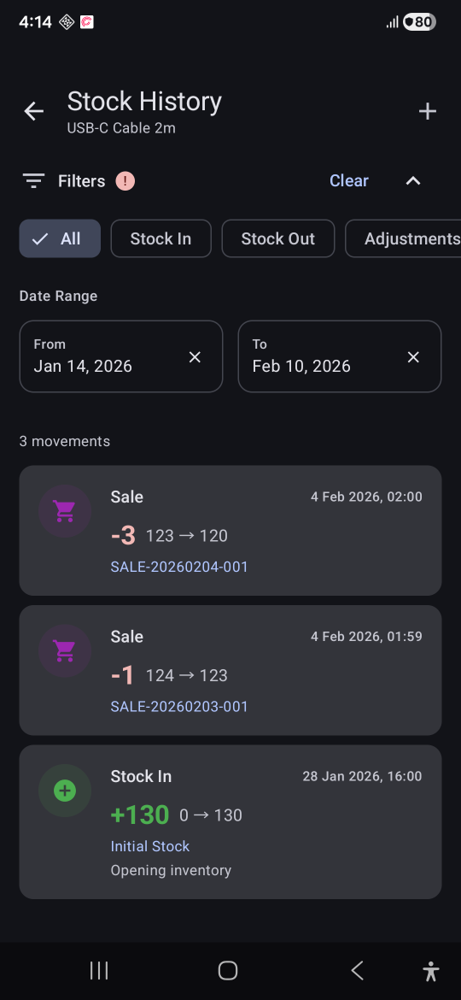 |

</div>

---
## 🎬 [StockWise DEMO - YouTube](https://youtu.be/hc8KFlWHrpQ)

| Dashboard | Products | Stock Movements |
|:-----------:|:-----------:|:-----------:|
|  |  |  |

---

## 📲 [Download & Install the App](https://github.com/UsmanAnsari/StockWise/releases/download/1.0.0/app-debug.apk)

---

## 🛠️ Tech Stack

| Category | Technology | Why This Choice |
|----------|------------|-----------------|
| **Language** | Kotlin 2.2.21 | Coroutines, Flow, null safety, sealed classes for MVI |
| **UI Framework** | Jetpack Compose + Material 3 | Declarative UI eliminates view binding boilerplate |
| **Architecture** | Clean Architecture + MVI | Enforces testability and unidirectional data flow |
| **Dependency Injection** | Hilt | Compile-time DI with less boilerplate than manual Dagger |
| **Database** | Room (SQLite) | Type-safe SQL with native Flow support for reactive UI |
| **Async** | Kotlin Coroutines + Flow | Native async/reactive — no RxJava overhead |
| **Navigation** | Jetpack Navigation Compose | Type-safe nav graph integrated with Compose |
| **Testing** | JUnit, MockK, Turbine, Truth | Kotlin-first tools; Turbine simplifies Flow assertions |


---
## 🏗️ Architecture

StockWise follows **Clean Architecture** with strict layer boundaries and dependency inversion. The domain layer has zero Android dependencies — all business logic is pure Kotlin, making it fully testable without an emulator.

### Clean Architecture Layers
```
┌─────────────────────────────────────────────────────────────┐
│                    PRESENTATION LAYER                       │
│  ┌─────────────┐  ┌─────────────┐  ┌─────────────────────┐  │
│  │   Screens   │  │  ViewModels │  │  Contracts (MVI)    │  │
│  │  (Compose)  │  │   (State)   │  │ State/Event/Effect  │  │
│  └─────────────┘  └─────────────┘  └─────────────────────┘  │
├─────────────────────────────────────────────────────────────┤
│                      DOMAIN LAYER                           │
│  ┌─────────────┐  ┌─────────────┐  ┌─────────────────────┐  │
│  │  Use Cases  │  │   Models    │  │Repository Interfaces│  │
│  │  (32 total) │  │  (Domain)   │  │                     │  │
│  └─────────────┘  └─────────────┘  └─────────────────────┘  │
├─────────────────────────────────────────────────────────────┤
│                       DATA LAYER                            │
│  ┌─────────────┐  ┌─────────────┐  ┌─────────────────────┐  │
│  │Repositories │  │    DAOs     │  │      Entities       │  │
│  │   (Impl)    │  │   (Room)    │  │    (6 entities)     │  │
│  └─────────────┘  └─────────────┘  └─────────────────────┘  │
└─────────────────────────────────────────────────────────────┘
```

### MVI Pattern

The app follows **unidirectional data flow** for predictable state management:
```
┌────────────────────────────────────────────────────────────┐
│                         MVI FLOW                           │
│                                                            │
│                    ┌──────────────┐                        │
│     ┌─────────────►│     VIEW     │──────────────┐         │
│     │              │   (Screen)   │              │         │
│     │              └──────────────┘              │         │
│     │                                            │         │
│   STATE                                        EVENT       │
│ (Immutable)                                  (Intent)      │
│     │                                            │         │
│     │              ┌──────────────┐              │         │
│     └──────────────│  VIEWMODEL   │◄─────────────┘         │
│                    └──────┬───────┘                        │
│                           │                                │
│                    ┌──────▼───────┐                        │
│                    │   USE CASE   │                        │
│                    └──────┬───────┘                        │
│                           │                                │
│                    ┌──────▼───────┐                        │
│                    │  REPOSITORY  │                        │
│                    │  (Room DAOs) │                        │
│                    └──────────────┘                        │
└────────────────────────────────────────────────────────────┘
```

---

## 🗄️ Database Schema

StockWise uses **Room** with **6 entities** including a **junction table** for a many-to-many relationship between Products and Sales — a pattern commonly required in real-world inventory and e-commerce systems.

### Entity Relationship Diagram
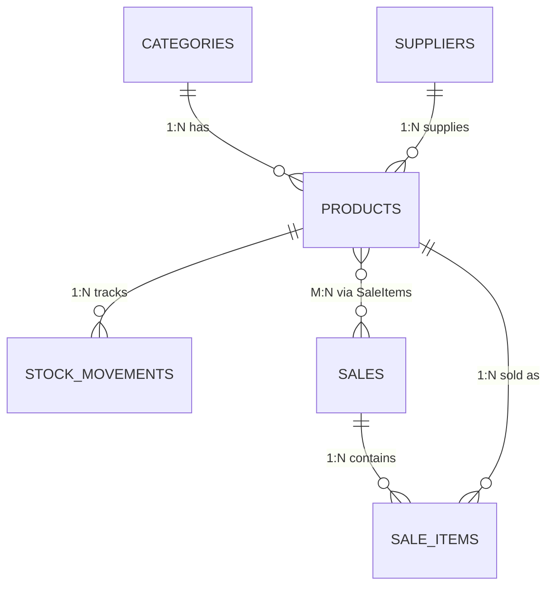
```mermaid
erDiagram
    CATEGORIES ||--o{ PRODUCTS : "1:N has"
    SUPPLIERS ||--o{ PRODUCTS : "1:N supplies"
    PRODUCTS ||--o{ STOCK_MOVEMENTS : "1:N tracks"
    PRODUCTS }o--o{ SALES : "M:N via SaleItems"
    SALES ||--o{ SALE_ITEMS : "1:N contains"
    PRODUCTS ||--o{ SALE_ITEMS : "1:N sold as"

    CATEGORIES
    
    SUPPLIERS
    
    PRODUCTS 
    
    STOCK_MOVEMENTS
    
    SALE_ITEMS
    
    SALES
```

### Junction Table: Sale Items (M:N)

The `SALE_ITEMS` table resolves the many-to-many relationship between Products and Sales while also preserving a **data snapshot** at the time of sale — a critical pattern for financial accuracy in inventory systems:

```
┌──────────┐       ┌─────────────┐       ┌──────────┐
│ PRODUCTS │◄──────│ SALE_ITEMS  │──────►│  SALES   │
│          │  1:N  │ (Junction)  │  N:1  │          │
│    id    │       │ productId   │       │    id    │
│          │       │ saleId      │       │          │
└──────────┘       │ quantity    │       └──────────┘
                   │ unitPrice*  │
                   │ productName*│
                   └─────────────┘
                   
* Snapshot fields — preserve data at time of sale,
  so historical records remain accurate even if
  the product is later updated or deleted.
```

### Database Design Highlights

| Feature | Implementation | Purpose |
|---------|----------------|---------|
| **M:N Relationship** | `SaleItems` junction table | Links Products ↔ Sales without data duplication |
| **Data Snapshots** | Price + name stored in `SaleItems` | Historical accuracy for past sales records |
| **Soft Delete** | `isActive` flag on Products | Preserves referential integrity across foreign keys |
| **Audit Trail** | `StockMovements` table | Every inventory change is permanently recorded |
| **Delete Protection** | Count-check before delete | Categories/Suppliers can't be removed while linked to products |

---

## 📊 Use Cases Overview

StockWise implements **32 Use Cases** following the Single Responsibility Principle — every operation is isolated, independently testable, and maps to exactly one business action.

<details>
<summary><b>Dashboard Use Cases (4)</b></summary>

- `GetInventoryStatsUseCase` — Total products, stock value, categories count
- `GetDailySalesSummaryUseCase` — Daily sales metrics
- `GetLowStockProductsUseCase` — Products below reorder threshold
- `GetRecentSalesUseCase` — Recent sales activity feed

</details>

<details>
<summary><b>Product Use Cases (8)</b></summary>

- `GetProductsWithDetailsUseCase` — Products with joined category/supplier data
- `GetProductWithDetailsUseCase` — Single product with full details
- `GetProductByIdUseCase` — Lightweight ID lookup
- `FilterProductsUseCase` — Filter and sort by multiple criteria
- `ValidateProductUseCase` — Form validation including SKU uniqueness
- `CreateProductUseCase` — Create new product
- `UpdateProductUseCase` — Update existing product
- `DeleteProductUseCase` — Soft delete (preserves historical records)

</details>

<details>
<summary><b>Category Use Cases (7)</b></summary>

- `GetCategoriesUseCase` — All categories
- `GetCategoriesWithProductCountUseCase` — Categories with live product counts
- `GetCategoryByIdUseCase` — Single category lookup
- `ValidateCategoryUseCase` — Name uniqueness validation
- `CreateCategoryUseCase` — Create category
- `UpdateCategoryUseCase` — Update category
- `DeleteCategoryUseCase` — Delete with product-count protection

</details>

<details>
<summary><b>Supplier Use Cases (7)</b></summary>

- `GetSuppliersUseCase` — All suppliers
- `GetSuppliersWithProductCountUseCase` — Suppliers with live product counts
- `GetSupplierByIdUseCase` — Single supplier lookup
- `ValidateSupplierUseCase` — Contact details validation
- `CreateSupplierUseCase` — Create supplier
- `UpdateSupplierUseCase` — Update supplier
- `DeleteSupplierUseCase` — Delete with product-count protection

</details>

<details>
<summary><b>Stock Use Cases (6)</b></summary>

- `GetStockMovementsForProductUseCase` — Full movement history for a product
- `GetStockMovementsSummaryUseCase` — Totals by movement type
- `FilterStockMovementsUseCase` — Filter by type and date range
- `AddStockUseCase` — Inbound stock movement
- `RemoveStockUseCase` — Outbound stock movement
- `AdjustStockUseCase` — Manual stock level correction

</details>

---

## 🎯 Key Implementation Highlights

### 1. MVI Contract Pattern

```kotlin
// ProductsContract.kt — Clean separation of UI concerns

data class ProductsState(
    val isLoading: Boolean = true,
    val products: List<ProductWithDetails> = emptyList(),
    val searchQuery: String = "",
    val selectedFilter: StockFilter = StockFilter.ALL,
    val sortOption: SortOption = SortOption.NAME
) : UiState {
    // Derived state — computed once, not duplicated
    val isEmpty: Boolean get() = products.isEmpty() && !isLoading
}

sealed interface ProductsEvent : UiEvent {
    data object LoadProducts : ProductsEvent
    data class OnSearchQueryChanged(val query: String) : ProductsEvent
    data class OnFilterChanged(val filter: StockFilter) : ProductsEvent
    data class OnSortChanged(val sort: SortOption) : ProductsEvent
    data class OnDeleteProduct(val productId: Long) : ProductsEvent
}

sealed interface ProductsEffect : UiEffect {
    data class NavigateToDetail(val productId: Long) : ProductsEffect
    data class ShowSnackbar(val message: String) : ProductsEffect
}
```

### 2. Delete Protection Pattern

```kotlin
class DeleteCategoryUseCase @Inject constructor(
    private val categoryRepository: CategoryRepository,
    private val productRepository: ProductRepository
) {
    suspend operator fun invoke(categoryId: Long): Result<Unit> {
        // Guard: check for linked products before deletion
        val productCount = productRepository.getProductCountByCategory(categoryId)
        
        if (productCount > 0) {
            return Result.failure(
                CategoryHasProductsException(
                    "Cannot delete: $productCount products are linked to this category"
                )
            )
        }
        
        return categoryRepository.deleteCategory(categoryId)
    }
}
```

### 3. Use Case Validation with SKU Uniqueness

```kotlin
class ValidateProductUseCase @Inject constructor(
    private val productRepository: ProductRepository
) {
    suspend operator fun invoke(params: ValidationParams): ValidationResult {
        val errors = mutableMapOf<String, String>()
        
        if (params.name.isBlank()) {
            errors[FIELD_NAME] = "Product name is required"
        }
        
        // SKU uniqueness — exclude current product on edit
        val existingProduct = productRepository.getProductBySku(params.sku)
        if (existingProduct != null && existingProduct.id != params.excludeProductId) {
            errors[FIELD_SKU] = "SKU already exists"
        }
        
        return ValidationResult(isValid = errors.isEmpty(), errors = errors)
    }
}
```

---

## 🧪 Testing

StockWise has **95+ tests** across unit and instrumented test suites, covering business logic, state management, and database operations.

### Test Coverage Breakdown

| Layer | Type | What's Tested |
|-------|------|---------------|
| **Use Cases** | Unit (JUnit + MockK) | Business logic, validation, delete protection |
| **ViewModels** | Unit (Turbine) | State transitions, event handling, effects |
| **DAOs** | Instrumented (Room in-memory) | Queries, relationships, cascade behaviour |

### Example: ViewModel Test with Turbine

```kotlin
@Test
fun `search query filters products correctly`() = runTest {
    viewModel = createViewModel()
    advanceUntilIdle()
    
    viewModel.onEvent(ProductsEvent.OnSearchQueryChanged("iPhone"))
    advanceUntilIdle()
    
    val state = viewModel.uiState.value
    assertThat(state.products.all {
        it.product.name.contains("iPhone", ignoreCase = true)
    }).isTrue()
}
```

### Example: DAO Test with In-Memory Room

```kotlin
@Test
fun `getProductCountByCategory returns correct count`() = runTest {
    // Arrange — insert category and linked products
    val categoryId = categoryDao.insert(testCategory)
    productDao.insert(testProduct1.copy(categoryId = categoryId))
    productDao.insert(testProduct2.copy(categoryId = categoryId))
    
    // Assert
    val count = productDao.getProductCountByCategory(categoryId)
    assertThat(count).isEqualTo(2)
}
```

---

## 🚧 Scope: Portfolio vs Production

### What's Implemented

| Feature | Status | Notes |
|---------|--------|-------|
| **Product CRUD** | ✅ Complete | With validation and soft delete |
| **Inventory Tracking** | ✅ Complete | Full audit trail via StockMovements |
| **M:N Database Schema** | ✅ Complete | Junction table with data snapshots |
| **Delete Protection** | ✅ Complete | Referential integrity enforced in use cases |
| **32 Use Cases** | ✅ Complete | Every operation single-responsibility |
| **95+ Tests** | ✅ Complete | Unit + instrumented coverage |
| **CI/CD Pipeline** | 🔜 Planned | GitHub Actions — next phase |

### Production Enhancements

In a production app, I would additionally implement:

| Enhancement | Why | Complexity |
|-------------|-----|-----------|
| **CI/CD Pipeline** | Automated testing on every push | Low (GitHub Actions) |
| **Barcode Scanning** | Faster stock intake for physical warehouses | Medium (CameraX + ML Kit) |
| **Reports & Analytics** | Charts for stock trends and sales performance | Medium (MPAndroidChart) |
| **Cloud Sync** | Multi-device access for business teams | High (backend + auth) |
| **Export (CSV/PDF)** | Reporting for accounting integrations | Medium |

---

## 🎓 What I Learned

<details>
<summary><b>Database Design</b></summary>

**M:N relationships require careful thought** — A product can appear in many sales, and a sale contains many products. The naive approach (storing a list in one table) doesn't work in relational databases. The junction table pattern solves this cleanly while also enabling snapshot data.

**Snapshot data is a production requirement** — If you store only a foreign key to the product in `SaleItems`, and the product price changes later, all historical sale records become inaccurate. Storing `unitPrice` and `productName` at the time of sale preserves financial history correctly.

**Soft delete protects your data** — Hard-deleting a product that appears in historical stock movements or sales would corrupt your audit trail. The `isActive` flag lets you "remove" it from the UI while keeping the data intact.

</details>

<details>
<summary><b>Architecture at Scale</b></summary>

**32 use cases sounds like a lot — it isn't** — Each use case is 10–30 lines of pure Kotlin. The discipline of one-operation-per-class means every piece of business logic is independently testable and easy to locate. When a bug appears in delete protection, you go to exactly one file.

**Delete protection belongs in the domain layer** — My first instinct was to handle this in the ViewModel. Moving it to a use case means it applies regardless of which screen triggers the delete, and it's testable without any Android dependencies.

**Computed state beats duplicated state** — The `isEmpty` computed property on `ProductsState` avoids the bug where `products.isEmpty()` and a separate `isEmpty` flag get out of sync.

</details>

<details>
<summary><b>Testing Strategy</b></summary>

**In-memory Room databases are fast and reliable** — Using `Room.inMemoryDatabaseBuilder()` in instrumented tests gives you a real database without touching disk. DAO tests run quickly and catch query issues that unit tests can't find.

**MockK's `coEvery` is essential for suspend functions** — Testing use cases that call `suspend` repository methods requires coroutine-aware mocking. MockK handles this elegantly.

**Test the unhappy path** — My most valuable tests are the ones that verify delete protection throws the right exception. The happy path rarely reveals architecture problems.

</details>

---

## 🚀 Getting Started

### Prerequisites

- Android Studio Hedgehog (2023.1.1) or newer
- JDK 17
- Android SDK 29+
- No API keys required — fully local/offline app

### Installation

1. **Clone the repository**
```bash
git clone https://github.com/UsmanAnsari/StockWise.git
cd StockWise
```

2. **Build and Run**
```bash
./gradlew installDebug
# Or click Run ▶️ in Android Studio
```

### Running Tests

```bash
# Unit tests
./gradlew test

# Instrumented tests (requires connected device or emulator)
./gradlew connectedAndroidTest
```

---

## 📁 Project Structure

```
app/src/main/java/com/uansari/stockwise/
│
├── 📂 data/                      # Data Layer
│   ├── local/
│   │   ├── dao/                  # Room DAOs (Products, Categories, Suppliers, Stock, Sales)
│   │   ├── entity/               # Room Entities & Relation classes
│   │   └── StockWiseDatabase.kt  # Room Database & TypeConverters
│   └── repository/               # Repository implementations
│
├── 📂 domain/                    # Domain Layer (zero Android dependencies)
│   ├── model/                    # Domain models
│   ├── repository/               # Repository interfaces
│   └── usecase/                  # 32 Use Cases
│       ├── dashboard/
│       ├── product/
│       ├── category/
│       ├── supplier/
│       └── stock/
│
├── 📂 ui/                        # Presentation Layer
│   ├── base/                     # Base MVI classes (UiState, UiEvent, UiEffect)
│   ├── components/               # Shared Compose components
│   ├── navigation/               # Nav graph & bottom navigation
│   ├── dashboard/
│   ├── products/
│   ├── categories/
│   ├── suppliers/
│   └── stock/
│
├── 📂 di/                        # Dependency Injection (Hilt modules)
│   ├── DatabaseModule.kt
│   └── RepositoryModule.kt
│
└── 📂 util/                      # Shared utilities and extensions
```

---

## 🗺️ Roadmap

- [x] Phase 1: Database design & Room foundation
- [x] Phase 2: Clean Architecture + MVI implementation
- [x] Phase 3: 95+ tests (unit + instrumented)
- [ ] Phase 4: CI/CD Pipeline (GitHub Actions)
- [ ] Phase 5: Sales/POS module
- [ ] Phase 6: Reports & Analytics
- [ ] Phase 7: Barcode scanning

---

## 👤 Author

**Usman Ali Ansari**

- 💼 LinkedIn: [usman1ansari](https://www.linkedin.com/in/usman1ansari)
- 🐙 GitHub: [@UsmanAnsari](https://github.com/UsmanAnsari)
- 📧 Email: usman10ansari@gmail.com

---

<div align="center">

**Built with ❤️ to demonstrate production-ready Android development**

</div>

</div>
